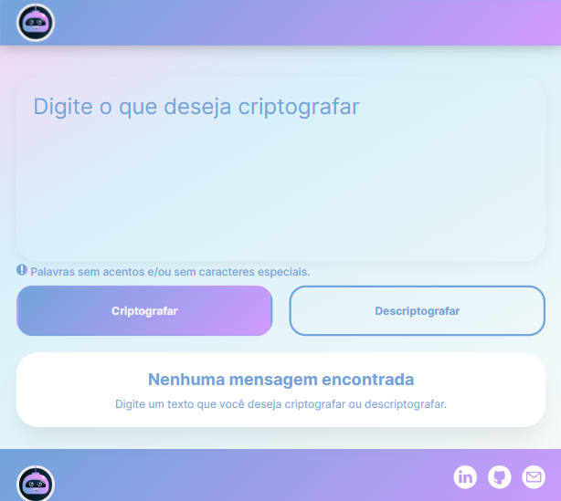

# Decodificador de texto

Projeto desenvolvido com o objetivo estudar a lógica de programação e criar um programa que criptografe  e descriptografe textos conforme solicitado.
      

## Desafio ONE - Oracle + Alura

Construir um decodificador de texto com Javascript, CSS e HTML. Sem utilizar nenhuma biblioteca e framework. 

### Etapas do projeto

* [Figma](https://www.figma.com/file/tvFEYhVfZTjdJ5P24RGV21/Alura-Challenge---Desafio-1---L%C3%B3gica?type=design&node-id=16-802&t=o3XKQB67uUKTKIIS-0})- modelo pronto passado pela Alura mas fiz modificações quando passei para o código como cor, elementos, logo, criação de personagem, dentre outros;
* Illustrator - criação do logo e personagem;
* Html - estrutura semântica dos elementos;
* CSS - responsividade pelo princípio mobile first e trabalhando com variáveis para fácil manutenção;
* Javascript - criação de funções e condições para melhor performance na usabilidade. Para isso foram passados algumas regras e informações:
> As "chaves" de criptografia que utilizaremos são:
> * A letra "e" é convertida para "enter"
> * A letra "i" é convertida para "imes"
> * A letra "a" é convertida para "ai"
> * A letra "o" é convertida para "ober"
> * A letra "u" é convertida para "ufat"

>Requisitos:
>- Deve funcionar apenas com letras minúsculas
>- Não devem ser utilizados letras com acentos nem caracteres especiais
>- Deve ser possível converter uma palavra para a versão criptografada e também retornar uma palavra criptografada para a versão original.

>Por exemplo:  
>"gato" => "gaitober"  
>gaitober" => "gato"

## Projeto

Decodificador de texto finalizado pode ser utilizado clicando [aqui](https://decode-navy.vercel.app/).

  
Personagem

  
      

  
Versão Mobile

  
  

  
Versão Tablet

  
      

            

  
 Versão Desktop

  
      

  
 Aplicação funcionando

 
<video width="100%" style="padding:2rem"  controls>
  <source src="./assets/images/video.mp4" type="video/mp4">
</video>
  

